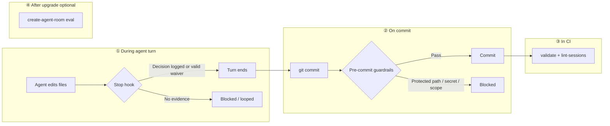

# create-agent-room

[](https://www.npmjs.com/package/create-agent-room)
[](https://github.com/sipandey/create-agent-room/actions/workflows/ci.yml)

**Define your agent governance rules once. `create-agent-room` enforces them at every layer an agent passes through — while it's working (Claude + Cursor stop hooks), when it commits, in CI, and optionally via compliance evals — instead of just documenting them and hoping.**


*A staged AWS key blocked at commit time, then the same for an agent turn ending without a logged decision — both real, unmocked output. Reproduce it yourself with `bash scripts/demo.sh`.*

Most "AI agent guidelines" are a Markdown file an agent may or may not read. `create-agent-room` scaffolds that documentation (`AGENTS.md`, a principles playbook, a workflow classifier, multi-agent coordination protocols) but backs the parts that matter with **four concrete enforcement points**, each catching a different failure mode:

1. **While the agent is working** — shared **Claude Code `Stop`** and **Cursor `stop`** hooks (`.agent-room/hooks/close-the-loop-check.js`) block or loop the turn when source files changed without logging to `.agent-room/decisions.md` or `anti-patterns.md`. **Evidence-lite** checks go further: the log-file *diff* must contain a valid waiver (`<!-- no-log: ... -->` with ≥20 chars and a deliberate keyword) or a structured entry — not just a file touch. Cursor uses `followup_message`; Claude uses `exit 2`. No `--no-verify` equivalent.
2. **When it commits** — a git pre-commit hook (`guardrails-check.js`) blocks commits that touch protected paths, match forbidden patterns (AWS keys, private keys, tokens), or exceed `scopeGuidance` limits. Every `GUARDRAILS_BYPASS` is recorded in `.agent-room/guardrails-bypass-log.md`.
3. **In CI** — `validate` and `lint-sessions` fail the build if the guardrails schema, skill frontmatter, or session logs are malformed (`lint-sessions` also rejects placeholder `Decisions made` when status is Completed).
4. **After upgrades (optional CI)** — `eval` runs packaged compliance regression scenarios (close-the-loop, lint-sessions, validate fixtures) with JSON/CSV export — no LLM, no API keys.



Full detail — code paths, adapters, what `eval` does *not* cover:
[docs/enforcement-model.md](docs/enforcement-model.md).

Not every feature here is enforced this way — see [Feature Categories](#feature-categories) below and [CAPABILITIES.md](CAPABILITIES.md) for the honest breakdown of what's mechanical versus what still depends on an agent choosing to follow a doc.

---

## Features

- **Agent Runtime Enforcement (Stop Hooks)**: Shared checker for **Claude Code** (`Stop` → `exit 2`) and **Cursor** (`stop` → `followup_message`). **Evidence-lite** validates log-file diffs, not just porcelain touches. Requires `--tools claude` and/or `--tools cursor`.
- **Compliance Evals (`eval`)**: Packaged regression pack for close-the-loop, `lint-sessions`, and `validate` — `--format json|csv` for CI dashboards. Exit `1` on failure. No LLM.
- **Agent Guardrails**: `guardrails.json` — protected paths, forbidden regex/literal patterns, `scopeGuidance` limits, durable bypass audit log. *[Pre-commit hook when `--tools git`]*
- **Multi-Tool Sync (`sync`)**: Mirrors `.agent-room/skills/` → `.claude/skills/`; regenerates Cursor `.cursor/rules/agent-room.mdc` and Windsurf/Cline/Codex rule files from the current skill list.
- **Session Log & Schema Validation**: `validate` + `lint-sessions` in scaffolded CI when `--tools git`. *[Fails build if malformed]*
- **Health Check (`doctor`)**: Read-only drift/advisory report — hook template drift, stale CI pins, unwired tools. Never writes to disk.
- **Multi-Agent Coordination**: Handoff, scope, session log templates. *[Guidance only — `--profile full`]*
- **Inheritance & Composition**: Base → stack → org → project template layers.
- **Built-in & External Skill Packs**: testing, security, release, code-review, etc., or remote Git/local paths via `--skill-packs`.
- **Observability Metrics**: Post-hoc session dashboard from `.agent-room/sessions/`.
- **PR Description Generator**: Latest session log → PR template (`pr-desc --write`).

---

## Feature Categories

### 🟢 Actively Enforced Features
These features actively constrain behavior and will fail/block operations if violated:

- **Agent Runtime Enforcement** — Claude `Stop` + Cursor `stop` hooks; evidence-lite diff validation on log files
- **Compliance Evals** — `eval` runs builtin regression scenarios; `--format json|csv`; exit `1` on failure
- **Agent Guardrails** — Pre-commit hook (optional; `--tools git`); bypass audit log
- **Session Log Validation** — `lint-sessions` + scaffolded CI workflow (`--tools git`)
- **Skill Frontmatter Validation** — `validate` command
- **Multi-Tool Sync** — `sync` keeps Claude skills and Cursor/Windsurf/Cline/Codex rules aligned with `.agent-room/skills/`

### 🟡 Prescriptive Guidance (Requires Human Discipline)
These features provide templates and protocols that agents must choose to follow:

- **Workflow Classifier** — Guides agents to tag work as Bug / Enhancement / Feature / Product (not automatically enforced)
- **Multi-Agent Coordination Protocols** — Handoff, scope, session log format templates exist but agents must follow them manually
- **Principles Playbook** — 12 guidelines for reliable LLM output; agents must apply them

### 🔵 Aspirational/Framework Features
These provide a framework that requires external setup:

- **Stack-Specific Templates** — Inheritance system supports Python, TypeScript, React stacks, but these must be created or provided via `--org` or `--template-source`
- **Observability Metrics** — Post-hoc aggregation of completed sessions; not real-time monitoring or alerting
- **Tool Adapters** — Currently supports Claude, Cursor, Windsurf, Cline, Codex, and Git; `sync` mirrors skills to Claude and regenerates rules files for Cursor, Windsurf, Cline, and Codex from `.agent-room/skills/`

---

## What Requires Human Discipline?

Some features depend on agents choosing to follow documented guidance. **There is no automatic enforcement**:

- **Workflow Classification** — Agents must tag work as Bug / Enhancement / Feature / Product when creating session logs
- **Following Coordination Protocols** — Agents must read and follow handoff, scope, and session log format guidelines
- **Writing good Decisions & Anti-patterns entries** — Stop hooks force logging or a valid waiver; evidence-lite checks *structure* in the diff, not prose quality. Windsurf/Cline/Codex have rule files but no runtime stop hook.
- **Applying Principles** — Agents must read the principles playbook and apply them; the tool provides no real-time guidance
- **Respecting Tool Rules** — Tool adapters (Claude, Cursor, etc.) provide guidance files, but tools decide whether/how to apply them

These features work **only if your team commits to following them**. The tool creates the structure and validation hooks; discipline is external.

For comprehensive details on what's enforced, guidance, and aspirational, see [CAPABILITIES.md](CAPABILITIES.md). For the four enforcement layers, adapters, and what `eval` does not cover, see [docs/enforcement-model.md](docs/enforcement-model.md).

Considering an alternative — hand-rolled hooks, a direct competitor, or
just a plain `AGENTS.md`? See [docs/comparisons.md](docs/comparisons.md)
for an honest comparison, including where this tool currently loses.

---

## Usage

`create-agent-room` is published on npm. **Install once, then invoke directly**
— don't use `npx` for automation or repeat runs; its temporary install/exec
path has failed intermittently (including on GitHub-hosted runners — see
`.agent-room/anti-patterns.md`). An explicit global install is reliable:

```bash
npm install -g create-agent-room
```

| Command | Purpose |
| ------- | ------- |
| `init` | Scaffold agent-room structure, hooks, and tool adapters |
| `sync` | Mirror `.agent-room/skills/` → Claude/Cursor/Windsurf/Cline/Codex |
| `validate` | Structural + schema checks (exit `1` on failure) |
| `lint-sessions` | Session log schema validation (exit `1` on failure) |
| `eval` | Packaged compliance regression scenarios (exit `1` on failure) |
| `metrics` | Session log observability dashboard |
| `pr-desc` | Generate PR description from latest session log |
| `doctor` | Read-only health check (never writes) |

```bash
# Initialize a new project with all tool adapters, git initialization, and specific skill packs:
create-agent-room init ../my-project --tools claude,cursor,git --git --skill-packs testing,security,observability

# Scaffolding using template inheritance (Base -> Python stack -> Acme Org rules):
create-agent-room init . --yes --language python --org acme

# Fetching skill packs dynamically from a remote git repository:
create-agent-room init . --yes --skill-packs https://github.com/my-org/custom-skills.git

# Preview exactly what init would create/skip, writing nothing to disk:
create-agent-room init . --tools claude,git --git --dry-run

# Opt into the full guidance corpus (principles, workflow classifier, coordination protocols):
create-agent-room init . --yes --profile full --tools claude,git --git

# Mirror skills and regenerate tool rule files after editing .agent-room/skills/:
create-agent-room sync .

# Verify mirrors are up to date without rewriting (CI-friendly):
create-agent-room sync . --check

# Run integrity validation on the room (exits with code 1 if files are missing or skill frontmatter is malformed):
create-agent-room validate .

# Validate session logs against required structure (exits 1 on error):
create-agent-room lint-sessions .

# Run packaged compliance regression scenarios (no LLM):
create-agent-room eval
create-agent-room eval --format json --output compliance-report.json

# Generate an observability report dashboard based on session logs:
create-agent-room metrics .

# Generate a Pull Request description from the latest session log and save it:
create-agent-room pr-desc . --write

# Read-only health check — works whether or not init has been run yet, writes nothing:
create-agent-room doctor .
```

Pin a version when reproducibility matters: `npm install -g create-agent-room@2.3.0`.
For a project-local install, use `npm install create-agent-room` and
`./node_modules/.bin/create-agent-room` (or add an npm script).

**Example: Init Command**


If you're working from a clone of this repo instead (contributing, or
testing an unreleased change), use `node bin/cli.js` in place of
`create-agent-room`:

```bash
node bin/cli.js init my-new-project
node bin/cli.js sync .
node bin/cli.js validate .
node bin/cli.js lint-sessions .
node bin/cli.js eval
node bin/cli.js metrics .
node bin/cli.js pr-desc . --write
node bin/cli.js doctor .
```

See [CONTRIBUTING.md](CONTRIBUTING.md) for local setup, tests/lint, and
scope guidelines before opening a PR.

---

## Directory Structure

```
AGENTS.md                          Generic entry point read by any agent
.agent-room/
  principles.md                    12 playbooks for reliable LLM output           [--profile full only]
  workflow-classifier.md           Bug / Enhancement / Feature / Product routing  [--profile full only]
  guardrails.md                    Prose boundaries and constraints (what not to do)
  guardrails.json                  Machine-readable guardrail rule schema
  guardrails-bypass-log.md         Append-only, auto-written record of every GUARDRAILS_BYPASS use
  anti-patterns.md                 Append-only negative-knowledge log (starts empty)
  decisions.md                     Append-only decisions log (starts empty)
  hooks/                           [--tools claude and/or cursor]
    close-the-loop-check.js        Shared Stop/stop hook (Claude exit 2, Cursor followup_message)
    closing-the-loop-evidence.js   Evidence-lite diff validation for log files
  skills/
    brainstorming.md               Brainstorming rules, hard-gated
    writing-plans.md               Design-to-task plan blueprints
    test-driven-development.md     TDD red-green-refactor loop
    systematic-debugging.md        Root-cause analysis protocols
    verification-before-completion.md   Double-checking results before completion
    closing-the-loop.md            Closing out decisions and anti-patterns
    [skill packs]                  observability.md, api-design.md, database-migrations.md, etc. (opt-in via --skill-packs, either profile)
  coordination/                    [--profile full only]
    handoff-protocol.md            Protocols for serializing state between sessions
    scope-boundaries.md            Resource ownership guidelines
    session-log-format.md          Layout template for writing session logs
  sessions/                        Directory where session logs get saved
docs/plans/                        Where design docs and task plans get saved
.agent-room.json                   Project config tracking language, tools, branch, skill packs, and profile
.claude/                           [--tools claude] skills mirror + settings.json Stop hook
.cursor/rules/                     [--tools cursor] agent-room.mdc rule (regenerated by sync)
```

`--profile minimal` (the default) skips the two rows and the whole
`coordination/` directory marked above — see [Profiles](#profiles-minimal-vs-full).

---

## Subcommands

### 1. `init [target-dir]`

Scaffold the agent workspace. If files already exist in the target, they are skipped by default to protect manual edits unless `--force` is specified. Defaults to `--profile minimal`; pass `--dry-run` to preview what would be created/skipped without writing anything. See [Options](#options) and [Profiles](#profiles-minimal-vs-full).

### 2. `sync [target-dir]`

Synchronize custom skills from `.agent-room/skills/` into tool-specific mirrors:

- **Claude** (when listed in `.agent-room.json`): `.claude/skills/<name>/SKILL.md`
- **Cursor** (when listed): regenerate `.cursor/rules/agent-room.mdc` from the packaged template + current skill list
- **Windsurf / Cline / Codex** (when listed): regenerate `.windsurfrules`, `.clinerules`, or `.codexrules` from the same skill list

- Run with `--check` to verify mirrors are out of date without rewriting them.
- Sync will automatically skip overwriting files if they have uncommitted tracked edits, unless `--force` is used.

### 3. `validate [target-dir]`

Performs structural validation and linting on the room. Returns exit code `1` on error:

- Asserts presence of all mandatory files and folders (e.g. `AGENTS.md`, `guardrails.md`).
- Lints skill files under `.agent-room/skills/*.md` to ensure they contain Jekyll-style frontmatter headers (`---`) with valid `name` and `description` attributes.
- Parses and validates `.agent-room/guardrails.json` schema.
- Reads the `profile` recorded in `.agent-room.json` to decide whether `principles.md`/`workflow-classifier.md`/`coordination/` are required (`full`) or merely recommended-with-a-warning (`minimal`) — a `--profile minimal` room is not an error.

**Example: Validation Passed**


**Example: Validation Failed**


### 4. `lint-sessions [target-dir]`

Validates all session logs in `.agent-room/sessions/` against the required schema (Date, Agent, Classification, Goal, Files touched, Actions taken, Tests run, Decisions, Outcome).

- Returns exit code `1` if validation fails (suitable for CI gating)
- Rejects placeholder `Decisions made` when status is `Completed`
- Reports errors (missing required sections) and warnings (invalid classifications, missing files)

**Usage in CI:**

```yaml
- name: Install create-agent-room
  run: npm install -g create-agent-room
- name: Validate Session Logs
  run: create-agent-room lint-sessions .
```

(Use `npm install -g create-agent-room` — not `npx` — so install and exec
are separate, diagnosable steps. The scaffolded `init --tools git` workflow
does this automatically.)

Already ran `init --tools git`? Use the workflow file it scaffolded
instead of writing this by hand — see [GitHub Action](#github-action)
below for when to use which.

### 5. `metrics [target-dir]`

Aggregates all JSON and Markdown session logs inside `.agent-room/sessions/` and renders a clean CLI dashboard detailing outcome success rates, task type distributions, and overall file edit volumes.

**Example: Metrics Dashboard**


### 6. `pr-desc [target-dir]`

Parses the latest session log inside `.agent-room/sessions/` (based on timestamp filename order) and formats it into a Pull Request description template.

- Use `--write` (or `-w`) to output and save it directly to `.agent-room/pr-description.md`.

**Example: PR Description Output**


### 7. `doctor [target-dir]`

Read-only health check for a project — works whether or not `init` has
ever been run. Writes nothing to disk, regardless of what it finds.

- **No `.agent-room/` found**: detects the workspace's language/tools and
  prints the `init` (and `init --dry-run`) command to run.
- **Already scaffolded**: reuses `validate`'s structural/schema checks,
  plus advisory-only checks `validate` doesn't do — hook files that have
  drifted from the CLI's current templates, a CI workflow pinned to a
  stale or `@latest` `create-agent-room` version, and `.agent-room.json`
  claiming a tool (`claude`, `git`) that isn't actually wired up on disk.
- Prints `🔴 Needs attention` / `🟡 Recommended` / `🟢 Looks good`, and
  suggests `init . --force` to refresh drifted files when relevant (this
  overwrites manual edits to those files — review with `git diff`
  afterward).

Unlike `init --force`, `doctor` never writes — it's the tool to reach for
when you just want to know what's wrong before deciding whether to fix it.

### 8. `eval`

Runs the **packaged compliance regression pack** shipped with the CLI —
deterministic scenarios for close-the-loop, `lint-sessions`, and `validate`
(no LLM, no API keys). Useful in CI to confirm governance checks still
behave as intended after upgrades.

```bash
create-agent-room eval
create-agent-room eval --format json --output compliance-report.json
create-agent-room eval --suite close-the-loop
```

- Exit code `1` if any case fails
- `--format text|json|csv` (default: `text`)
- `--suite close-the-loop|lint-sessions|validate|all` (default: `all`)

---

## GitHub Action

For repos that want CI validation without running `create-agent-room init`
at all, `validate`, `lint-sessions`, and `eval` are also available — either
via the composite [GitHub Action](action.yml) or by installing the CLI:

```yaml
- uses: actions/checkout@v4
- uses: sipandey/create-agent-room@v2
```

The Action runs `validate` and `lint-sessions`. To also run compliance
regressions after upgrades, add a step:

```yaml
- run: npm install -g create-agent-room
- run: create-agent-room eval --format json --output compliance-report.json
```

This does the same thing as the `init --tools git`-scaffolded workflow
above — use whichever fits how the repo was set up, not both. Full input
reference and examples: [docs/github-action.md](docs/github-action.md).

---

## Options

| Flag                       | Effect                                                                                                                                                                                                            |
| -------------------------- | ----------------------------------------------------------------------------------------------------------------------------------------------------------------------------------------------------------------- |
| `--name <name>`            | Project name substituted into templates (default: target dir name)                                                                                                                                                |
| `--tools <list>`           | Comma-separated: `claude,cursor,windsurf,cline,codex,git,none` (default: prompt)                                                                                                                                  |
| `--template-source <path>` | Custom templates folder path (default: searches local, home, package)                                                                                                                                             |
| `--package-manager <name>` | Package manager to use, e.g. npm, poetry, cargo (default: npm)                                                                                                                                                    |
| `--language <name>`        | Target project language, e.g. typescript, python, rust (default: javascript)                                                                                                                                      |
| `--branch <name>`          | Default git branch (default: main)                                                                                                                                                                                |
| `--skill-packs <list>`     | Comma-separated built-in names (`testing`, `security`, `release`, `code-review`, `api-design`, `database`, `performance`, `observability`, `documentation`), Git URLs (`git+ssh://...`), or local directory paths |
| `--org <name>`             | Organization layer directory name to look for during template inheritance overlays                                                                                                                                |
| `--profile <name>`         | `minimal` (default) or `full` — see [Profiles](#profiles-minimal-vs-full) below                                                                                                                                   |
| `--git`                    | Run `git init` and create an initial commit in the target directory                                                                                                                                               |
| `--force`                  | Overwrite existing files instead of skipping them                                                                                                                                                                 |
| `--dry-run`                | Print exactly what `init` would create/skip; write nothing to disk                                                                                                                                                |
| `--write, -w`              | Save generated PR description output to `.agent-room/pr-description.md`                                                                                                                                           |
| `--check`                  | `sync` only — verify mirrors are up to date without rewriting; exit `1` if drift detected                                                                                                                       |
| `--format <text\|json\|csv>` | `eval` only — output format (default: `text`)                                                                                                                                                                   |
| `--output <file>`          | `eval` only — write report to file instead of stdout                                                                                                                                                              |
| `--suite <name>`           | `eval` only — `close-the-loop`, `lint-sessions`, `validate`, or `all` (default: `all`)                                                                                                                            |
| `--verbose`                | Print detailed stack traces on failure                                                                                                                                                                            |
| `-y, --yes`                | Skip all prompts, use defaults                                                                                                                                                                                    |

### Profiles: `minimal` vs `full`

`--profile minimal` is the default. It scaffolds `AGENTS.md` (kept slim),
`guardrails.md` + `guardrails.json`, the base skills, and the Stop/pre-commit
hooks (when the corresponding adapter is selected) — everything that's
either mechanically enforced or directly load-bearing. It skips
`principles.md`, `workflow-classifier.md`, `coordination/`, and skill packs
(skill packs are opt-in regardless of profile — pass `--skill-packs` to add
them under either profile).

`--profile full` restores everything: the full guidance corpus described
throughout this README.

This default is deliberate, not arbitrary: per Gloaguen et al. 2026 (ETH
Zurich), verbose LLM-facing context files measurably reduce agent
performance and increase token cost relative to minimal ones. `init`
reports an approximate token count for whatever it scaffolds (see the
post-scaffold summary), so you can judge the trade-off directly rather than
taking it on faith. Teams that want the complete framework should pass
`--profile full` explicitly.

---

## Template Composition & Inheritance

`create-agent-room` supports a powerful hierarchical layering mechanism. The overlay resolver will find and inherit files, merging folders in order from lowest-priority to highest-priority:

1. **Packaged Default Templates** (built-in base rules) ✅ Provided
2. **Packaged Stack-specific Templates** (e.g. `templates/stacks/python/`) ✅ Provided
3. **Global Templates** (`~/.agent-room-templates/base/`) 🔵 User-provided (optional)
4. **Global Stack-specific Templates** (`~/.agent-room-templates/stacks/python/`) 🔵 User-provided (optional)
5. **Global Org-specific Templates** (`~/.agent-room-templates/org/<org-name>/`) 🔵 User-provided via `--org` (optional)
6. **Local Templates** (`.agent-room-templates/` or `--template-source`) 🔵 User-provided (optional)

During this overlay process, files in higher-priority folders will overwrite conflicts from lower layers, enabling modular organization-wide guidelines with project-level overrides.

**Note:** Layers 3-6 are **aspirational** — the framework supports them, but you must create or provide these templates yourself. Layers 1-2 ship with the package. To use stack inheritance effectively, create your org's stack templates in layer 5 or provide them at project init time.
