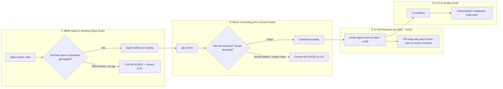

# create-agent-room

[](https://www.npmjs.com/package/create-agent-room)
[](https://github.com/sipandey/create-agent-room/actions/workflows/ci.yml)
[](package.json)
[](LICENSE)

**Physical seatbelts for AI coding agents.** Stop hoping your AI agents follow rules — mechanically prevent them from breaking tests, leaking secrets, or wandering outside their assigned tasks across Claude Code, Cursor, Copilot, Windsurf, Cline, and Codex.

---

## 💡 What Problem Does This Solve?

Imagine hiring a brilliant junior developer who types at 200 words a minute, works 24/7, but has **zero impulse control**:

1. **The "Trust Me, It Works" Trap:** The AI agent says, *"I've refactored the login system and all tests pass!"* But in reality, it never ran your test suite — and it quietly broke 4 critical user flows.
2. **The Accidental Secret Leak:** While testing an API, the agent paste-tests an active AWS access key, GitHub personal token, or modifies your `.env` file and stages it to Git.
3. **The Blast Radius Creep:** You ask the agent to adjust a CSS margin on the homepage. Thirty seconds later, it has modified your database schema, rewritten the Dockerfile, and touched 18 unrelated backend files.
4. **The Amnesic Coworker:** The agent rewrites a complex algorithm from scratch because it had no memory of *why* the original author designed it that way. No decisions were recorded, so history repeats itself every week.

### Why "Just Write an `AGENTS.md`" Doesn't Work

Most teams try to solve this by creating an `AGENTS.md` or `.cursorrules` file filled with polite instructions:
> *"Please run npm test before declaring victory."*  
> *"Please never commit secrets."*  
> *"Please stay within the frontend directory."*

**AI models do not consistently obey prose guidelines.** As soon as the conversation gets long or complex, the agent ignores instructions, forgets context, or hallucinates that it followed your rules.

**You cannot solve a mechanical problem with polite documentation. You need physical seatbelts.**

---

## 🛡️ How `create-agent-room` Solves It: 4 Mechanical Seatbelts

`create-agent-room` wraps your codebase in **active runtime gates** that make it physically impossible for an AI agent to cut corners:



1. **Seatbelt 1 (During the Turn):** When Claude Code or Cursor tries to finish, CAR automatically runs your repository's test runner (`npm test`, `pytest`, `cargo test`, `go test`). If tests fail, CAR blocks the agent, feeds the failure logs back to the LLM, and forces it to fix the issue before it can stop.
2. **Seatbelt 2 (At Commit Time):** A Git pre-commit hook scans staged diffs for AWS keys, private tokens, and protected paths (`.env`, CI configs). If a secret is detected or if the agent changed too many files outside its boundary, the commit is blocked.
3. **Seatbelt 3 (At Pull Request Time):** When generating a PR (`create-agent-room pr-desc --verify`), CAR executes the test suite live, embeds tamper-evident test proof into the PR description, and generates an interactive reviewer compliance checklist.
4. **Seatbelt 4 (Across the Whole Team):** Define your team's rules and skills once. Running `create-agent-room sync --all` automatically keeps Claude Code, Cursor, GitHub Copilot, Windsurf, Cline, and Codex in 100% alignment.

---

## ⚡ 30-Second Quickstart

You don't even need to install anything globally to try it on your project:

```bash
# 1. Run in your project root (safe: skips existing files, never overwrites without permission)
npx create-agent-room init . --yes

# 2. That's it! Your repository is now an Agent Room.
```

Or install globally for fast everyday use:

```bash
npm install -g create-agent-room
```

### What Just Happened?

`create-agent-room` added a lightweight, self-contained governance room:
- **`AGENTS.md`**: The universal entry point explaining your project boundaries to any agent.
- **`.agent-room/guardrails.json`**: Machine-readable safety rules (secrets scanning, protected paths, file limits).
- **`.agent-room/decisions.md`**: An append-only log capturing architectural decisions so agents don't repeat past mistakes.
- **`.agent-room/hooks/`**: The automatic pre-commit and stop hooks that enforce compliance behind the scenes.

**Want to see it in action?**
```bash
# Try to end a Claude or Cursor session without logging a decision:
# => The Stop Hook intercepts the agent and prompts it to record its reasoning.

# Try to stage an AWS key or edit a protected file:
# => The Git hook blocks the commit and logs an auditable entry.
```


---

## 🎬 Real-World Scenarios: Before & After

### Scenario 1: The "I Fixed It" Hallucination
* **The Problem:** Claude edits 3 files to fix a bug. It proudly declares: *"The authentication issue is resolved! Have a nice day!"* In reality, it broke your password-reset endpoint and never ran `npm test`.
* **With CAR:** When Claude tries to complete the turn, CAR's Pre-Stop hook intercepts it, automatically runs `npm test`, detects the failure, and returns:
  ```text
  ❌ Verification Gate Failed: npm test exited with code 1
     FAIL test/auth.test.js: password reset token mismatch
  You must fix test failures before completing your turn.
  ```
  Claude sees the exact error, fixes the bug, re-runs tests until they pass, and only then yields back to you.

---

### Scenario 2: The Leaked API Key
* **The Problem:** An agent creates a temporary script to test an external API and hardcodes an AWS access key (`AKIA...`) or GitHub token directly in the source file. It stages the file and attempts to commit.
* **With CAR:** Git immediately aborts the commit:
  ```text
  ❌ Guardrails Check Failed: Commit violates project guardrails
     - Forbidden pattern found in api.js: AWS Access Key ID
  To bypass in an emergency, use: GUARDRAILS_BYPASS=1 git commit
  ```
  If bypassed with `GUARDRAILS_BYPASS=1`, CAR permanently records who bypassed it, when, and why in `.agent-room/guardrails-bypass-log.md` so the waiver is visible in code review.

---

### Scenario 3: The Multi-Tool Team
* **The Problem:** Alice uses **Cursor**, Bob uses **Claude Code**, Charlie uses **GitHub Copilot**, and Dave uses **Windsurf**. Everyone creates their own custom prompt files (`.cursorrules`, `.claude/skills`, `.github/copilot-instructions.md`, `.windsurfrules`). Within two weeks, rules diverge, conflict, and cause chaos.
* **With CAR:** You store your team's skills once in `.agent-room/skills/`. Run:
  ```bash
  create-agent-room sync --all
  ```
  CAR instantly updates all 6 tool adapters simultaneously. Have personal custom prompts in `.cursorrules` or `.windsurfrules`? CAR automatically detects marker comments (`<!-- user-customizations -->`) and preserves your custom edits untouched!

---

### Scenario 4: Scope Containment & Blast Radius Control
* **The Problem:** You assign an AI agent to upgrade UI icons in `src/components/`. The agent gets confused by an import, starts refactoring your backend API routes, and ends up modifying 22 files across the repository.
* **With CAR:** You configure scope guidance or pass allowed paths:
  ```json
  "scopeGuidance": { "maxFilesPerChange": 5, "maxLinesPerChange": 200 }
  ```
  If the agent touches more than 5 files or edits outside its boundary, the commit is immediately blocked before the merge conflict disaster occurs.

---

### Scenario 5: Reviewer-Ready PRs with Verified Evidence
* **The Problem:** Developers submit PRs generated by AI with generic descriptions like *"Updated some functions"*. Human reviewers spend 30 minutes manually checking if the code compiles, if tests actually ran, and whether any architectural guidelines were broken.
* **With CAR:** Run one command before opening your PR:
  ```bash
  create-agent-room pr-desc --verify --write
  ```
  CAR executes your test suite live, links your architectural decisions, checks for guardrail bypasses, and generates a rich PR description:
  ```markdown
  ### Verification Evidence
  <details open>
  <summary>✅ Verification Passed (npm test, exit 0, 1.2s)</summary>
  261 tests passed, 0 failures.
  </details>

  ### Reviewer Compliance Checklist
  - [x] Automated test suite executed & passed
  - [x] Architectural decisions recorded in .agent-room/decisions.md
  - [x] No unapproved guardrail bypasses
  - [x] Scope contained within task boundaries
  ```

---

### Scenario 6: Self-Healing Maintenance in 1 Second
* **The Problem:** Over time, someone edits a Git hook by mistake, a package upgrade leaves templates out of sync, or a new developer clones the repo without setting up the Claude stop hook.
* **With CAR:** Run:
  ```bash
  create-agent-room doctor --fix
  ```
  CAR diagnoses your entire repository, detects missing hooks or drifted templates, and repairs them automatically without clobbering your custom code.

---

## 🎯 Choose Your Governance Preset

Every project is different. A weekend side-project has different needs than a regulated banking system. Choose the right strictness preset using `--preset` (or `--profile`):

```bash
create-agent-room init . --yes --preset <minimal|standard|strict>
```

| Preset | Who It's For | What It Enforces | Guidance Token Overhead |
| :--- | :--- | :--- | :--- |
| **`minimal`** *(Default)* | Solopreneurs, prototypes, and fast-moving small apps | Basic `AGENTS.md`, Git pre-commit secrets guardrails, Stop hook, and core skills. Skips secondary documentation to minimize LLM token costs. | ~6,500 tokens |
| **`standard`** | Production software teams & established repos | Everything in `minimal` + **Automated Pre-Stop Test Verification Gate** + complete principles playbook, task classifier, and handoff protocols. | ~12,500 tokens |
| **`strict`** | Enterprise, financial, healthcare, & high-compliance repos | Everything in `standard` + **Pre-Commit Test Execution** (`verifyOnCommit`) + **Architectural Import Boundaries** (`importBoundaries`) + **Strict Waiver Audits** (mandates ticket references like `ticket: #123` and ≥40 character rationale for overrides) + tight scope limits (10 files / 300 lines). | ~12,500 tokens |

---

## 🧰 Everyday Commands Cheatsheet

| Command | Everyday Scenario | Example |
| :--- | :--- | :--- |
| `init` | Protect a new or existing repository | `create-agent-room init . --yes --preset standard` |
| `sync` | Sync skills across Claude, Cursor, Copilot, Windsurf, Cline, Codex | `create-agent-room sync --all` |
| `verify` | Run the configured verification test suite standalone (CI / scripts) | `create-agent-room verify . --strict --format json` |
| `pr-desc` | Generate an attested PR description with proof of tests & checklist | `create-agent-room pr-desc . --verify --write` |
| `doctor` | Check repository health and auto-heal drifted configuration | `create-agent-room doctor . --fix` |
| `metrics` | Export session productivity, pass rates & compliance data | `create-agent-room metrics . --format markdown --output AUDIT.md` |
| `eval` | Run built-in and custom compliance regression eval packs | `create-agent-room eval . --format json` |
| `validate` | Verify repository structure, guardrails schema, and skill frontmatter | `create-agent-room validate .` |
| `lint-sessions` | Validate session logs against required structure | `create-agent-room lint-sessions .` |
| `session` | Scaffold or record an audit-compliant session log & handoff | `create-agent-room session --record` |
| `skill` | Inspect, install, or remove skill packs post-init with auto-sync | `create-agent-room skill add database,security` |
| `ci` | Run all room checks in headless CI with unified reporting | `create-agent-room ci --format markdown --summary` |

---

## 📖 Deep Dives for Common Tasks

### 1. Auto-Detecting Test Suites
You don't need to manually configure test commands. When you run `create-agent-room init`, CAR automatically inspects your project and detects your test suite:
- **Node.js / TypeScript**: Reads `package.json` (`npm test`, `pnpm test`, `yarn test`), safely filtering out empty placeholder scripts.
- **Python**: Detects `pytest.ini`, `pyproject.toml`, or test folders (`pytest`).
- **Rust**: Detects `Cargo.toml` (`cargo test`).
- **Go**: Detects `go.mod` (`go test ./...`).
- **Java / Kotlin**: Detects `./gradlew test` or `mvn test`.
- **Makefiles**: Detects `make test`.

Want to override it? Pass `--test-command "npm run test:unit"` or opt out with `--no-test-command`.

### 2. Multi-Agent Synchronization (`sync --all`)
When developers on your team add or modify custom skills under `.agent-room/skills/`, run:
```bash
create-agent-room sync --all
```
CAR generates:
- `.claude/skills/<name>/SKILL.md` (for Claude Code)
- `.cursor/rules/agent-room.mdc` (for Cursor)
- `.github/copilot-instructions.md` (for GitHub Copilot)
- `.windsurfrules` (for Windsurf)
- `.clinerules` (for Cline)
- `.codexrules` (for Codex)

### 3. Writing Custom Organization Compliance Evals (`eval`)
In addition to CAR's packaged regression suites, you can author repo-specific compliance tests in `.agent-room/evals/` or `evals/custom/`:
```json
{
  "id": "require-clean-security-audit",
  "suite": "security",
  "type": "command",
  "command": "npm audit --audit-level=high",
  "expect": "pass"
}
```
Run them with:
```bash
create-agent-room eval . --custom-only
create-agent-room eval --format json --output compliance-report.json
```

### 4. Automated Session Logging & Handoffs (`session`)
When completing a development turn or handing off to another agent, never lose context:
```bash
# Auto-detect modified files, commit messages, recent ADRs, and run test verification:
create-agent-room session --record

# Customize session metadata:
create-agent-room session fix-login --goal "Fix login race condition" --classification Bug --status Completed

# Dry-run preview in Markdown or structured JSON:
create-agent-room session --dry-run
create-agent-room session --json --dry-run
```
Every generated session log is guaranteed to pass `create-agent-room lint-sessions` with 0 errors and 0 warnings out of the box.

### 5. Dynamic Skill Pack Management (`skill`)
Easily manage your team's skill portfolio post-init without manually editing files:
```bash
# View installed, available, and custom workspace skill packs:
create-agent-room skill list

# Install built-in, remote Git, or local directory skill packs:
create-agent-room skill add database,observability
create-agent-room skill add https://github.com/org/ai-skills.git

# Remove a skill pack (automatically purges files and re-syncs all tool adapters):
create-agent-room skill remove database
```

### 6. Unified Headless CI Runner (`ci`)
Stop chaining disparate steps in your CI workflows. `create-agent-room ci` runs all room governance checks in a single deterministic pass:
1. **`validate`**: Verifies core files and guardrails schema.
2. **`doctor`**: Ensures git hooks and stop hooks haven't drifted.
3. **`lint-sessions`**: Ensures session logs conform to requirements.
4. **`verify`**: Executes your codebase test suite.
5. **`eval`**: Runs built-in and custom compliance eval suites.
6. **`pr`**: Enforces remote PR anti-tamper, detects rule weakening, audits bypass authorizations, and verifies session log presence.

```yaml
# .github/workflows/agent-room-ci.yml
name: Agent Room CI
on: [push, pull_request]

jobs:
  governance:
    runs-on: ubuntu-latest
    steps:
      - uses: actions/checkout@v4
      - uses: actions/setup-node@v4
        with:
          node-version: 20
      - run: npm install -g create-agent-room
      - name: Run Room Governance Checks
        run: create-agent-room ci --summary --comment
```

When running in GitHub Actions, passing `--summary` automatically writes an interactive Markdown scorecard directly to the **GitHub Actions Job Summary** (`$GITHUB_STEP_SUMMARY`)! Passing `--comment` automatically posts and updates a sticky compliance scorecard comment on pull requests without comment churn.

You can also use the official composite GitHub Action directly:
```yaml
- uses: actions/checkout@v4
  with:
    fetch-depth: 0
- uses: sipandey/create-agent-room@v2
  with:
    comment: true
    strict: true
```
See [docs/github-action.md](docs/github-action.md) for full action documentation.

---

### 7. Ambient Git Lifecycle & Hook Manager (`hook`)
Never worry about remembering CAR commands. `create-agent-room hook` seamlessly embeds CAR governance into standard `git` lifecycle hooks without clobbering existing developer hooks (Husky, Lefthook, or custom shell scripts):

```bash
# Inspect all git hooks, executable permissions, and drift
create-agent-room hook status

# Install pre-commit, pre-push, post-commit, post-checkout, and post-merge hooks
create-agent-room hook install --all

# Non-destructively remove CAR hooks while preserving all user scripts
create-agent-room hook uninstall --all
```

- **Non-Destructive Chaining:** Existing user scripts and tools like Husky are safely preserved; CAR embeds an isolated delimited block (`# --- create-agent-room hook: <name> ---`).
- **Supports Custom Hooks Directory:** Automatically detects and respects `git config core.hooksPath` (e.g. `.husky/`, `.agent-room/hooks/git/`).

#### Pre-Push Local CI Gate (`pre-push`)
Catch PR anti-tamper, unapproved rule weakening, test regressions, and missing session logs in milliseconds before code transmits to remotes:
- **Upstream Auto-Detection:** Automatically detects tracking branch (`@{upstream}`), remote defaults (`origin/main`, `origin/master`), or custom `base` ref.
- **Smart Branch Deletion Handling:** Safely bypasses execution when deleting remote branches.
- **Configurable in `.agent-room.json`:**
  ```json
  {
    "hooks": {
      "prePush": {
        "enabled": true,
        "strict": false,
        "skip": ["eval"]
      }
    }
  }
  ```
- **Fast Bypass Options:**
  - Standard git bypass: `git push --no-verify`
  - Environment variable: `CAR_SKIP_PRE_PUSH=1 git push`

---

## ⚙️ Complete CLI Options Reference

| Flag | Description | Applicable Commands |
| :--- | :--- | :--- |
| `--preset <name>` | Governance strictness profile: `minimal`, `standard`, `strict` (default: `minimal`) | `init` |
| `--profile <name>` | Interchangeable alias for `--preset` | `init` |
| `--tools <list>` | Comma-separated tools: `claude,cursor,windsurf,cline,codex,copilot,git,all,none` | `init`, `sync` |
| `--all` | Sync rules across all tools simultaneously, or manage all git hooks | `sync`, `hook` |
| `--hooks <list>` | Comma-separated git hooks (`pre-commit,pre-push,post-commit,post-checkout,post-merge`) | `hook` |
| `--test-command <cmd>` | Command executed to verify code changes before completing turns (e.g. `"npm test"`) | `init` |
| `--no-test-command` | Skip pre-stop test verification even if a test suite is detected | `init` |
| `--fix` | Automatically repair drifted hooks, missing stop hooks, and outdated CI pins | `doctor` |
| `--base <ref>` | Target base ref (`main`, `origin/main`) for PR anti-tamper and rule weakening audit | `ci` |
| `--verify`, `--with-verification` | Run verification test suite and embed attestation proof and reviewer checklist | `pr-desc` |
| `--strict` | Require tests to pass (exit `1` on test failure, warnings, or missing configuration) | `verify`, `pr-desc`, `ci` |
| `--evals-dir <path>` | Custom eval suites directory (default: `.agent-room/evals`, `evals/custom`) | `eval`, `ci` |
| `--custom-only` | Run only custom adopter compliance evals | `eval`, `ci` |
| `--builtin-only` | Run only packaged built-in compliance evals | `eval`, `ci` |
| `--skip <checks>` | Comma-separated list of CI checks to skip (e.g. `eval,verify`) | `ci` |
| `--skip-verify` | Skip code verification test execution in CI | `ci` |
| `--skip-doctor` | Skip hook and template drift checks in CI | `ci` |
| `--skip-eval` | Skip compliance eval suites in CI | `ci` |
| `--skip-sessions` | Skip session log format linting in CI | `ci` |
| `--skip-validate` | Skip room structure and schema checks in CI | `ci` |
| `--skip-pr` | Skip PR anti-tamper, rule weakening, and bypass audit gate in CI | `ci` |
| `--skip-pr-sessions` | Skip requiring session log for non-scaffold code changes in PR audit | `ci` |
| `--only <checks>` | Run only specified checks (comma-separated: `validate,doctor,sessions,verify,eval,pr`) | `ci` |
| `--comment`, `--pr-comment` | Post or update sticky compliance scorecard comment on pull requests | `ci` |
| `--github-token <token>` | GitHub token for posting PR comments (or `GITHUB_TOKEN` env var) | `ci` |
| `--pr <number>` | Pull request number for posting scorecard comments | `ci` |
| `--summary [file]` | Write or append Markdown scorecard to `$GITHUB_STEP_SUMMARY` or custom file | `ci` |
| `--format <type>` | Output format: `text`, `json`, `csv`, `markdown` | `eval`, `verify`, `metrics`, `ci` |
| `--output <file>` | Write report, session, or PR description directly to a file path | `session`, `eval`, `verify`, `metrics`, `pr-desc`, `ci` |
| `--write`, `-w` | Save generated PR description output to `.agent-room/pr-description.md` | `pr-desc` |
| `--record` | Auto-inspect git diff, recent commits, decisions.md, and run test suite | `session` |
| `--goal <sentence>` | Goal statement for session log | `session` |
| `--classification <type>` | Session classification (`Bug`, `Enhancement`, `Feature`, `Product`) | `session` |
| `--status <status>` | Session status (`Completed`, `Handed Off`, `In Progress`, `Blocked`) | `session` |
| `--agent <name>` | Agent identity string (default: git user or CAR_AGENT) | `session` |
| `--handoff <note>` | Handoff guidance for the next agent or human engineer | `session` |
| `--json` | Output session or skill report in structured JSON format | `session`, `skill`, `ci` |
| `--no-sync` | Skip auto-syncing skill files and tool rules after add/remove | `skill` |
| `--git` | Run `git init` and create an initial commit in target directory | `init` |
| `--force` | Overwrite existing files instead of skipping them, or force hook installation | `init`, `sync`, `skill`, `hook` |
| `--dry-run` | Preview what would be created or outputted without writing to disk | `init`, `session`, `skill` |
| `--check`, `-c` | Check if mirrored files are out of sync without writing changes (CI-friendly) | `sync` |
| `--skill-packs <list>` | Add built-in (`testing`, `security`, `release`, etc.) or remote Git skill packs | `init` |
| `--language <name>` | Target project language (e.g. `javascript`, `typescript`, `python`, `rust`) | `init` |
| `--package-manager <name>` | Package manager to use (`npm`, `pnpm`, `yarn`, `poetry`, `cargo`) | `init` |
| `--yes`, `-y` | Non-interactive mode; accept all defaults without prompting | `init` |
| `--verbose` | Print detailed error stack traces on failure | All |
| `--version`, `-v` | Print the installed `create-agent-room` version and exit | All |

---

## 🔒 Security & Dogfooding Invariants

- **Strictly Zero Dependencies:** `create-agent-room` has exactly **0 external runtime dependencies**. It runs entirely on the Node.js standard library (`fs`, `path`, `child_process`). No supply-chain risk.
- **100% Dogfooded:** This repository runs `create-agent-room` on itself. Every commit and turn is gated by the same stop hooks, pre-commit guardrails, and compliance evals described above.
- **329 Automated Tests:** Verified across unit, integration, and CLI end-to-end tests on every release.

---

## 📄 License

MIT © [Siddharth Pandey](https://github.com/sipandey)

